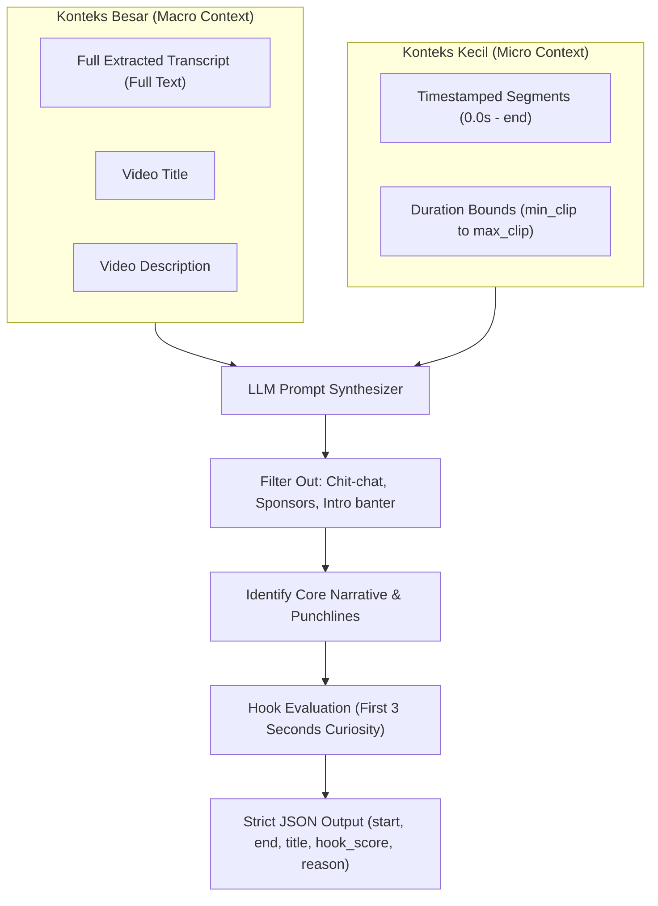

# 🧠 AI Curation & Two-Tier Context Architecture (`knowledge/ai-curation-and-context.md`)

This document details the curation logic, the **Two-Tier Context (Konteks Besar + Konteks Kecil)** system, OpenAI-compatible integration, heuristic fallbacks, and connection test gating.

---

## 1. Why Two-Tier Context?

Traditional transcript clipping fails because:
1. LLMs without macro context clip opening greetings, banter, or sponsor reads simply because they contain exciting words.
2. LLMs given only a macro summary fail to cut precise word-level start and end timestamps.

The **Two-Tier Context Architecture** solves both problems simultaneously:



---

## 2. Prompt Engineering Structure

The LLM prompt is implemented in [`backend/app/services/llm_service.py`](file:///Users/sultanherrysan/Documents/dev/web-development/clipping/backend/app/services/llm_service.py).

### System Prompt Directives:
- **Konteks Besar Directive**: Use the video title, description, and overall transcript flow to recognize the central argument or story arc. Ignore non-relevant tangents.
- **Konteks Kecil Directive**: Use exact timestamp boundaries. The first 3 seconds of the clip must contain a curiosity hook or intriguing question.
- **Duration Constraint**: Strictly adhere to `min_duration` and `max_duration` (configured in Settings, defaults 10s to 60s).
- **Format**: Output valid, parseable JSON strictly conforming to:
```json
{
  "clips": [
    {
      "start_time": 42.5,
      "end_time": 95.0,
      "title": "Rahasia Mindset yang Mengubah Segalanya",
      "hook_score": 92,
      "virality_reason": "Pernyataan pembuka membalikkan asumsi umum audiens dalam 2 detik pertama."
    }
  ]
}
```

---

## 3. Connection Test & AI Gatekeeping

To prevent unconfigured or dead LLM endpoints from silently hanging background jobs:
1. **Database Setting `llm_connected`**:
   - `true`: AI features and prompt queries are active.
   - `false`: AI curation is gated; system uses heuristic fallback and notifies the user to test connection.
2. **Auto-Reset Invariant**:
   Whenever any AI setting (URL, API key, model name) is saved via `POST /api/settings/ai`, the backend automatically resets `llm_connected = False`.
3. **Explicit Verification Route**:
   The user must click **"Uji Koneksi AI"** (`POST /api/settings/ai/test`). The backend pings the model via standard chat completion (`"ping"` test). Only when HTTP 200 is returned with valid response does `llm_connected` become `True`.

---

## 4. Smart Heuristic Fallback

If `llm_connected == False` or an external API failure occurs, the pipeline does NOT crash. Instead, [`heuristic_highlight_extraction`](file:///Users/sultanherrysan/Documents/dev/web-development/clipping/backend/app/services/llm_service.py) activates:
- Analyzes speech density (words per second) across sliding windows.
- Matches high-engagement Indonesian & English keywords (`"rahasia"`, `"tips"`, `"penting"`, `"jangan"`, `"kenapa"`, `"secret"`, `"mistake"`).
- Normalizes hook scores based on keyword presence and pause cadence.
- Ensures zero overlap $>50\%$ between candidate clips.
