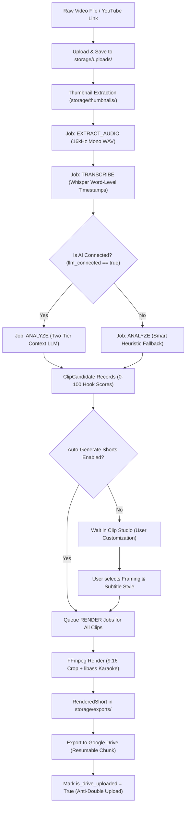
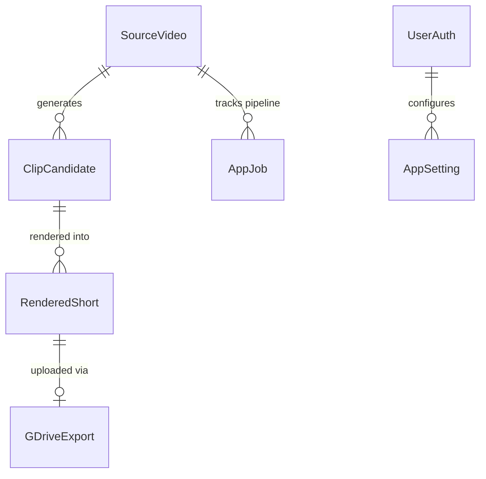

# 🏛️ System Architecture & Job Pipeline (`knowledge/architecture.md`)

This document outlines the core architecture, data flow, background queue worker, and database models of **AutoShorts Local**.

---

## 1. End-to-End Pipeline Flow



---

## 2. Background Queue Worker Architecture

The application runs a lightweight, persistent background job worker inside the FastAPI process (`backend/app/worker.py`).

### Job Lifecycle
Every asynchronous task is recorded in the `app_jobs` SQLite table:
```sql
CREATE TABLE app_jobs (
    id VARCHAR(36) PRIMARY KEY,
    job_type VARCHAR(32) NOT NULL, -- EXTRACT_AUDIO, TRANSCRIBE, ANALYZE, RENDER, GDRIVE_UPLOAD
    payload TEXT NOT NULL,         -- JSON parameters
    status VARCHAR(20) NOT NULL,   -- PENDING, RUNNING, COMPLETED, FAILED
    retry_count INTEGER DEFAULT 0,
    max_retries INTEGER DEFAULT 3,
    error_message TEXT,
    created_at DATETIME,
    updated_at DATETIME
);
```

### Worker Behavior
1. Worker loop runs every 1.5 seconds (`asyncio.sleep(1.5)`).
2. Uses row locking / status transitions to prevent double-processing.
3. Automatically increments `retry_count` on failure. If `retry_count >= max_retries`, marks job as `FAILED` and updates parent video or short status to `FAILED`.
4. Handlers are dispatched in [`backend/app/services/pipeline.py`](file:///Users/sultanherrysan/Documents/dev/web-development/clipping/backend/app/services/pipeline.py):
   - `handle_extract_audio`
   - `handle_transcribe`
   - `handle_llm_analyze`
   - `handle_render_short`
   - `handle_gdrive_upload`

---

## 3. Database Schema & Storage Map

SQLite database file is located at `storage/autoshorts.db`.
WAL mode is active (`PRAGMA journal_mode=WAL; PRAGMA busy_timeout=5000;`).

### Physical Storage Directories
| Directory | Contents | Format |
| :--- | :--- | :--- |
| `storage/uploads/` | Original source videos | `.mp4`, `.mkv`, `.mov`, `.webm` |
| `storage/audio/` | Extracted audio for transcription | `.wav` (16kHz 16-bit mono PCM) |
| `storage/transcripts/` | Word-level Whisper transcripts | `.json` |
| `storage/subtitles/` | Generated animated ASS subtitles | `.ass` (Advanced SubStation Alpha) |
| `storage/thumbnails/` | Video poster frames | `.jpg` (1280x720) |
| `storage/exports/` | Final rendered vertical shorts | `.mp4` (1080x1920 H.264 / AAC) |
| `storage/tts/` | Standalone generated voice narration | `.mp3` |
| `storage/credentials/` | Encrypted keys & tokens | `.json` / `.key` |

---

## 4. Key Entities Relationship



1. **SourceVideo**: Holds high-level metadata, video dimensions, duration, status, `description`, and `auto_generate_shorts`.
2. **ClipCandidate**: Segments identified by LLM or heuristics. Has `hook_score` (0–100), `virality_reason`, `start_time_seconds`, and `end_time_seconds`.
3. **RenderedShort**: The physical 9:16 MP4. Tracks rendering progress (`0–100%`), file size, `is_drive_uploaded`, and download URL.
4. **GDriveExport**: Records Google Drive file IDs and web-view links with chunk progress.
