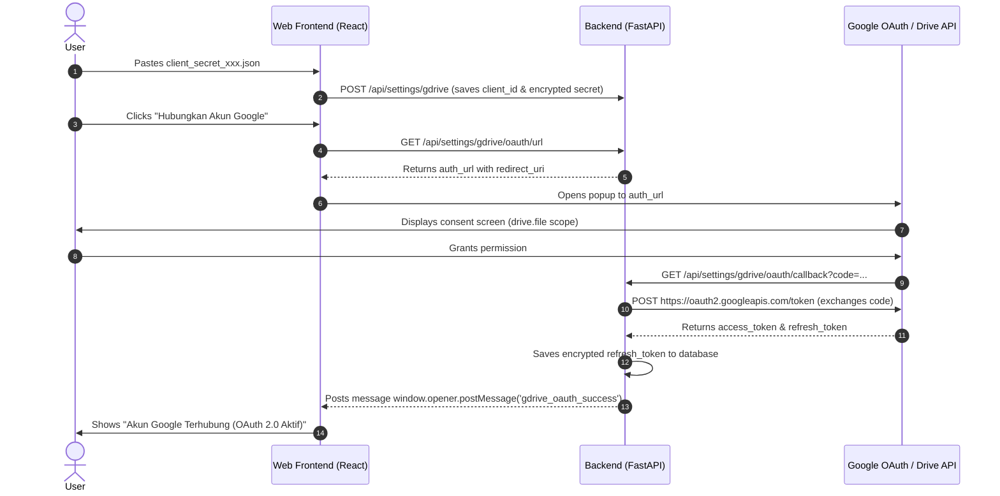

# ☁️ Google Drive Export Integration (`knowledge/gdrive-integration.md`)

This document explains the authentication mechanisms (OAuth 2.0 Web Client vs Service Account), token lifecycles, chunked resumable uploads, and anti-double upload protection.

---

## 1. Supported Authentication Methods

The system supports two distinct Google Drive authentication methods in [`backend/app/services/gdrive_service.py`](file:///Users/sultanherrysan/Documents/dev/web-development/clipping/backend/app/services/gdrive_service.py):

| Feature | OAuth 2.0 Web Client (Default) | Service Account Key |
| :--- | :--- | :--- |
| **Use Case** | Personal/Work Google Drive accounts | Headless server / automated bots |
| **JSON Structure** | `{"web": {"client_id": "...", "client_secret": "..."}}` | `{"type": "service_account", "client_email": "..."}` |
| **Folder Sharing** | Not required if folder is inside user's own Drive | Folder MUST be shared to `client_email` as Editor |
| **Interactive Flow** | One-time consent screen in browser popup | No browser login needed |
| **Token Saved** | AES-GCM Encrypted `refresh_token` | AES-GCM Encrypted `private_key` |

---

## 2. OAuth 2.0 Web Client Flow



### Registered Redirect URI
Google Cloud Console requires registering:
`http://localhost:8000/api/settings/gdrive/oauth/callback`

---

## 3. Resumable Chunked Upload

Shorts videos can range between 15MB to 80MB. Instead of uploading in a single blocking HTTP request, the pipeline uses Google Drive API's **resumable chunked upload protocol**:
- Chunk size: `8 * 1024 * 1024` (8 Megabytes).
- Spawns in an asynchronous thread (`asyncio.to_thread`).
- `MediaFileUpload(resumable=True)` issues chunk-by-chunk PUT requests.
- Invokes `progress_callback(pct)` after each chunk, updating `GDriveExport.upload_progress` in the database.

---

## 4. Anti-Double Upload Protection

To prevent duplicate files when users accidentally click export multiple times or retry queued jobs:
1. `RenderedShort.is_drive_uploaded` is an indexed boolean.
2. Before dispatching any upload job, the endpoint checks:
```python
if short.is_drive_uploaded:
    return {
        "status": "already_uploaded",
        "message": "Video short ini sudah pernah diunggah ke Google Drive.",
        "gdrive_file_id": gdrive_record.gdrive_file_id,
        "web_view_link": gdrive_record.gdrive_web_view_link
    }
```
3. Upon completion, `is_drive_uploaded` is set to `True`, and the public `web_view_link` is persisted.
