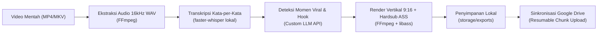

# Dokumentasi PRD - Local AI Video Clipper & Shorts Generator (`auto-shorts-local`)

Direktori ini berisi spesifikasi kebutuhan produk (*Product Requirements Document* / PRD) yang lengkap, terstruktur, dan siap diimplementasikan untuk proyek **Local AI Video Clipper & Shorts Generator**.

## Berkas Dokumentasi

- **[PRD.md](file:///Users/sultanherrysan/Documents/dev/web-development/clipping/prd/PRD.md)**: Dokumen spesifikasi utama (*Single Source of Truth*) versi 2.1.0 yang mencakup seluruh arsitektur sistem, skema basis data MySQL 8.0 DDL, REST API endpoints, state machine, spesifikasi storage lokal, mitigasi konversi format warna ASS BGR, prompt template LLM, Docker Compose & konfigurasi environment, hingga panduan implementasi berfase untuk AI coding agents.
- **[design.md](file:///Users/sultanherrysan/Documents/dev/web-development/clipping/design.md)**: Panduan sistem desain antarmuka (*Ember Studio*) yang menjadi standar visual, palet warna (*Terracotta & Amber*), tipografi (*Playfair Display & Source Sans 3*), komponen UI, serta panduan tata letak aplikasi web frontend.

---

## Ringkasan Alur Sistem



## Quick Start Implementasi

1. Pastikan Docker dan Docker Compose telah terpasang di mesin lokal.
2. Salin template konfigurasi lingkungan:
   ```bash
   cp .env.example .env
   ```
3. Ikuti tahapan implementasi berfase sesuai panduan pada [PRD.md Bagian 10](file:///Users/sultanherrysan/Documents/dev/web-development/clipping/prd/PRD.md#10-panduan-implementasi-berfase-untuk-ai-coding-agent).
