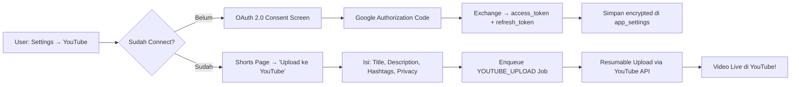
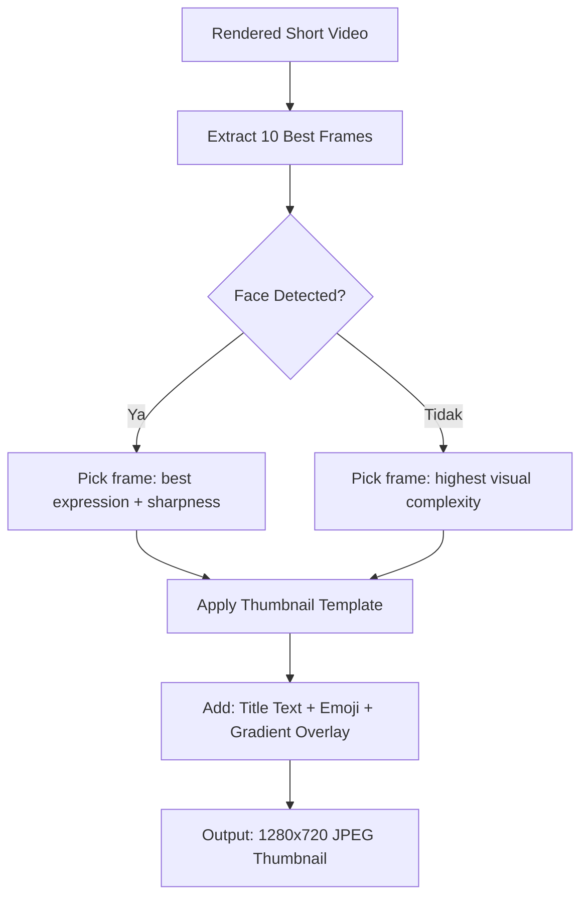
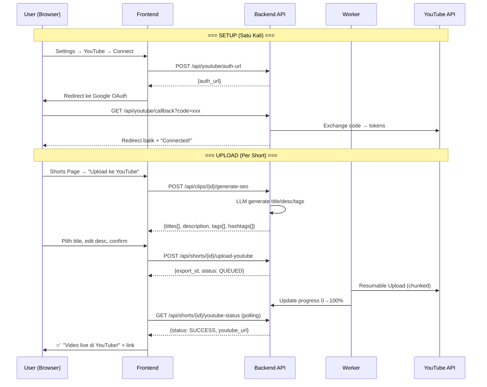

# Improvement PRD — AutoShorts Local (Ember Studio)
## Roadmap Perbaikan & Fitur Baru

| Field | Value |
| :--- | :--- |
| **Versi Dokumen** | 2.0.0 |
| **Dibuat** | September 2026 |
| **Berdasarkan Versi Aplikasi** | 2.2.0+ |
| **Status** | Draft — Phase 1-4 Done, Phase 5-8 Ready for Review |
| **Prioritas** | High (🔴) · Medium (🟡) · Low (🟢) |

> [!IMPORTANT]
> Semua peningkatan di bawah ini dirumuskan berdasarkan analisis mendalam terhadap codebase aktual (`llm_service.py`, `reframe_service.py`, `ffmpeg_service.py`, `ass_service.py`, `pipeline.py`, dan seluruh frontend). Setiap item mencantumkan file yang perlu dimodifikasi.

---

## Daftar Isi

1. [AI Clipper Accuracy](#1-ai-clipper-accuracy--peningkatan-akurasi-ai-clipper)
2. [Vision-Aware Clipping](#2-vision-aware-clipping--model-vision)
3. [Animasi & Sound Effect Kreatif](#3-animasi--sound-effect-kreatif-pada-video)
4. [Preset & Templating](#4-preset--templating-yang-lebih-baik)
5. [Face Location Detection untuk Streamer Preset](#5-face-location-detection-untuk-streamer-preset)
6. [UX & UI Improvements](#6-ux--ui-improvements)
7. [Infrastruktur & Performa](#7-infrastruktur--performa)
8. [YouTube Auto-Upload](#8-youtube-auto-upload--publish-langsung-ke-youtube) ⭐ NEW
9. [AI SEO — Title, Description & Hashtag Generator](#9-ai-seo--title-description--hashtag-generator) ⭐ NEW
10. [Smart Thumbnail Generation](#10-smart-thumbnail-generation--thumbnail-ai) ⭐ NEW
11. [AI Voice Intro](#11-ai-voice-intro--hook-audio-otomatis) ⭐ NEW
12. [Genre-Specific Analysis](#12-genre-specific-analysis--analisis-cerdas-per-jenis-konten) ⭐ NEW
13. [Fitur Tambahan Penting](#13-fitur-tambahan-penting) ⭐ NEW
14. [Updated Summary Prioritas](#14-updated-summary-prioritas--implementation-order)

---

## 1. AI Clipper Accuracy — Peningkatan Akurasi AI Clipper

### 1.1 🔴 Dual-Pass Context Comparison yang Lebih Cerdas

**Problem saat ini:**
`llm_service.py` sudah menerapkan Two-Tier Context (Konteks Besar + Konteks Kecil), namun keduanya dikirim dalam **satu request LLM tunggal**. Jika model kecil (misal: `gpt-4o-mini`, Ollama lokal), model tidak selalu mampu merekonsiliasi dua konteks besar tersebut dengan baik. Hasilnya: klip yang dipilih kadang tidak mencerminkan tema utama video atau memotong kalimat di tengah-tengah.

**Solusi: Sequential Two-Pass LLM Strategy**

```
Pass 1 (Macro Analysis):
  Input : video_title + video_description + full_text (rangkuman seluruh video)
  Output: { "video_type", "theme_summary", "must_avoid_topics", "must_include_topics", "tone" }
  Tujuan: Pahami *apa* video ini secara holistik — filter sponsor, intro basa-basi, topik tidak relevan.

Pass 2 (Micro Clip Selection):
  Input : hasil Pass 1 sebagai "editorial brief" + timestamped micro-segments
  Output: { clips: [...] }
  Tujuan: Pilih klip berdasarkan *brief* yang sudah bersih dari noise konteks besar.
```

**File yang dimodifikasi:**
- `backend/app/services/llm_service.py` — tambah fungsi `extract_highlights_two_pass()`
- `backend/app/services/pipeline.py` — `handle_llm_analyze()` panggil versi two-pass bila setting `llm_two_pass_enabled = true`
- `backend/app/routers/settings.py` — tambah toggle `llm_two_pass_enabled` di tab Koneksi AI

**Schema perubahan DB:**
- `app_settings`: tambah key `llm_two_pass_enabled` (default `false`)

**Acceptance Criteria:**
- [ ] Pass 1 menghasilkan `editorial_brief` JSON yang valid
- [ ] Pass 2 memakai `editorial_brief` sebagai system context tambahan
- [ ] Total timeout dua pass ≤ 90 detik (masing-masing 45 detik)
- [ ] Jika Pass 1 gagal, fallback ke single-pass existing

---

### 1.2 🔴 Adaptive Chunk Strategy untuk Video Panjang

**Problem saat ini:**
`format_transcript_for_llm()` memotong transkrip secara buta: ambil setengah awal + setengah akhir, buang bagian tengah (`...[omitted middle content]...`). Untuk video podcast 90+ menit, justru bagian tengah sering mengandung diskusi terdalam yang paling berpotensi viral.

**Solusi: Smart Segment Chunking**

Bagi transkrip menjadi N chunk temporal (misal: 3 chunk untuk video 60 menit, 5 chunk untuk 120 menit). Jalankan LLM sekali per chunk, kumpulkan semua kandidat, lalu lakukan **meta-ranking** dengan LLM pass final atau heuristik skor.

```python
# Pseudocode
def smart_chunk_transcript(segments, video_duration):
    num_chunks = max(3, min(6, int(video_duration // 1200)))  # 1 chunk per ~20 menit
    chunk_size = len(segments) // num_chunks
    return [segments[i*chunk_size:(i+1)*chunk_size] for i in range(num_chunks)]
```

**File yang dimodifikasi:**
- `backend/app/services/llm_service.py` — `extract_highlights_chunked()`
- `backend/app/services/pipeline.py` — `handle_llm_analyze()` pilih strategy berdasarkan `video.duration_seconds`
- `backend/app/routers/settings.py` — setting `llm_chunk_strategy` (`auto` / `single_pass` / `chunked`)

**Acceptance Criteria:**
- [ ] Video < 30 menit: tetap single-pass
- [ ] Video 30-90 menit: 3-chunk strategy
- [ ] Video > 90 menit: 5-chunk strategy
- [ ] Overlap suppression antar chunk berjalan (sudah ada di `validate_and_filter_candidates`)
- [ ] Jumlah klip akhir tetap max 10 (deduplicated)

---

### 1.3 🟡 Hook Quality Scoring yang Lebih Presisi

**Problem saat ini:**
`hook_score` hanya merupakan nilai 0-100 yang dikembalikan LLM secara kualitatif — tidak ada validasi independen. LLM sering memberikan skor tinggi pada semua klip (bias).

**Solusi: Multi-Dimensional Hook Scoring**

Tambah scoring lokal berbasis sinyal objektif yang dikombinasikan dengan skor LLM:

| Dimensi | Cara Hitung | Bobot |
| :--- | :--- | :--- |
| **LLM Score** | Nilai dari LLM response | 40% |
| **Speech Rate Spike** | Kecepatan kata/detik di segmen vs rata-rata video | 20% |
| **Keyword Density** | Kepadatan kata dari `HIGH_EMOTION_KEYWORDS` (`ass_service.py`) | 20% |
| **Hook Position** | Apakah 3 detik pertama klip mengandung kata kunci? | 20% |

```python
def compute_composite_score(llm_score, words, segment, all_segments):
    speech_rate_score = compute_speech_rate_percentile(segment, all_segments)
    keyword_score = compute_keyword_density(words)
    hook_position_score = check_hook_quality(words[:5])
    return (llm_score * 0.4 + speech_rate_score * 0.2 + 
            keyword_score * 0.2 + hook_position_score * 0.2)
```

**File yang dimodifikasi:**
- `backend/app/services/llm_service.py` — tambah `compute_composite_score()`, `validate_and_filter_candidates()` diperkaya dengan re-scoring
- `backend/app/models/all_models.py` — `ClipCandidate` tambah kolom `composite_score`, `speech_rate`, `keyword_density`

---

### 1.4 🟡 Re-Analyze Klip Individual (On-Demand Re-Clipping)

**Problem saat ini:**
Setelah analisis LLM selesai, pengguna tidak bisa meminta ulang analisis untuk satu video atau menyesuaikan durasi klip tanpa mengulang seluruh pipeline.

**Solusi:**
- Tambah endpoint `POST /api/videos/{video_id}/reanalyze` dengan parameter `min_dur`, `max_dur`, `custom_prompt_override`
- Tambah tombol "🔄 Analisis Ulang" di ClipStudioPage.tsx dengan modal konfirmasi (min/max durasi + custom prompt)

**File yang dimodifikasi:**
- `backend/app/routers/videos.py` — endpoint `reanalyze`
- `backend/app/services/pipeline.py` — `handle_llm_analyze()` support parameter override
- `frontend/src/pages/ClipStudioPage.tsx` — tombol + modal reanalyze

---

## 2. Vision-Aware Clipping — Model Vision

### 2.1 🔴 Frame-Level Visual Analysis untuk Highlight Detection

**Problem saat ini:**
Sistem hanya menganalisis **teks** (transkrip Whisper). Momen visual seperti ekspresi emosi intens, gestur dramatis, slide presentasi muncul, atau reaksi wajah tidak terdeteksi sama sekali.

**Solusi: Vision Model Integration**

Tambah opsional vision analysis pass menggunakan model multimodal (GPT-4V, Claude Haiku Vision, LLaVA lokal via Ollama):

```
Alur Vision Analysis:
1. Ekstrak 1 frame per 2 detik dari video (ffmpeg -r 0.5)
2. Batch frame ke dalam grid image (4x4 = 16 frame per gambar)
3. Kirim ke Vision LLM dengan prompt:
   "Identifikasi frame mana yang menunjukkan:
    - Ekspresi emosi intens (kaget, gembira, terkejut)
    - Gestur kuat / presentasi slide penting
    - Momen visual 'wow' atau dramatis
    Kembalikan timestamp frame yang menonjol."
4. Gabungkan hasil vision dengan hasil text LLM (weighted merge)
```

**File baru:**
- `backend/app/services/vision_service.py` — `extract_visual_highlights()`, `batch_frames_to_grid()`, `analyze_frames_with_vision()`

**File yang dimodifikasi:**
- `backend/app/services/llm_service.py` — tambah parameter `vision_analysis_result` di `extract_highlights_with_llm()`
- `backend/app/services/pipeline.py` — `handle_llm_analyze()` jalankan vision pass sebelum text LLM jika `llm_vision_enabled = true`
- `backend/app/routers/settings.py` — toggle `llm_vision_enabled`, `llm_vision_model` (bisa berbeda dari text model)

**Schema perubahan DB:**
```sql
-- app_settings baru:
llm_vision_enabled = 'false'
llm_vision_model = 'gpt-4o'  -- model yang support vision
llm_vision_weight = '0.3'    -- bobot visual score dalam composite
```

**Acceptance Criteria:**
- [ ] Vision pass bersifat opsional (off by default) dan tidak memblokir text analysis
- [ ] Jika vision model tidak support image input, degrades gracefully
- [ ] Frame grid diresizing ke ≤ 512px untuk efisiensi token
- [ ] Hasil vision menghasilkan list `{timestamp, visual_score, description}`
- [ ] Visual score digabungkan ke `composite_score` dengan bobot yang bisa dikonfigurasi

---

### 2.2 🟡 Visual Engagement Thumbnail Auto-Selection

**Problem saat ini:**
Thumbnail klip diambil di detik ke-1 secara statik (`ffmpeg_service.py: generate_thumbnail`). Hasilnya sering blur, motion blur, atau wajah tertutup.

**Solusi:**
Pilih frame terbaik dari klip menggunakan face detection score + sharpness score (Laplacian variance):

```python
async def select_best_thumbnail(video_path, start, end, n_candidates=10):
    # 1. Ekstrak n_candidates frame merata dalam rentang klip
    # 2. Untuk tiap frame: hitung face_score (ada wajah?) + sharpness_score
    # 3. Pilih frame dengan skor tertinggi
    # 4. Simpan sebagai thumbnail
```

**File yang dimodifikasi:**
- `backend/app/services/ffmpeg_service.py` — `generate_thumbnail()` tambah mode `smart`
- `backend/app/services/reframe_service.py` — reuse `_detect_faces()` untuk thumbnail scoring
- `backend/app/services/pipeline.py` — panggil smart thumbnail saat render selesai

---

## 3. Animasi & Sound Effect Kreatif pada Video

### 3.1 🔴 Motion Graphics Overlay (Intro/Outro Animated Stickers)

**Problem saat ini:**
Output video 9:16 saat ini hanya berisi: crop video + subtitle ASS + BGM. Tidak ada elemen kreatif visual tambahan yang membuat konten terasa lebih premium dan engaging.

**Solusi: Overlay Layer System via FFmpeg**

Tambah sistem layer overlay di `ffmpeg_service.py` yang memungkinkan:

1. **Intro Title Card** — teks judul klip muncul 0.5 detik pertama dengan animasi fade-in + slide
2. **Outro Card** — CTA (Call-to-Action) text di 2 detik terakhir ("Follow untuk lebih banyak tips!")
3. **Lower Third** — strip info nama pembicara di bagian bawah (sesuai metadata video)
4. **Sticker Overlay** — emoji/sticker animasi (GIF/WebP) yang ditempatkan di posisi tertentu
5. **Countdown Timer** — opsional timer di pojok (untuk konten challenge/countdown)

```python
# Contoh FFmpeg filter untuk animated intro text
def build_intro_title_overlay(title: str, duration: float = 1.5) -> str:
    escaped = title.replace("'", "\\'").replace(":", "\\:")
    return (
        f"drawtext=text='{escaped}':fontsize=48:fontcolor=white:alpha='if(lt(t,{duration}),t/{duration},0)':"
        f"x=(w-text_w)/2:y=h*0.15:shadowx=3:shadowy=3:shadowcolor=black"
    )
```

**File baru:**
- `backend/app/services/overlay_service.py` — `build_intro_overlay()`, `build_outro_overlay()`, `build_lower_third()`, `build_sticker_overlay()`

**File yang dimodifikasi:**
- `backend/app/services/ffmpeg_service.py` — `render_vertical_clip()` terima parameter `overlay_config: dict`
- `backend/app/services/pipeline.py` — `handle_render()` baca overlay settings dari preset
- `backend/app/models/all_models.py` — `TextPreset` tambah kolom overlay settings
- `backend/app/routers/presets.py` — CRUD overlay config
- `frontend/src/pages/PresetEditorPage.tsx` — tab baru "Overlay & Animasi"
- `frontend/src/components/SubtitleFrame.tsx` — preview overlay di simulator 9:16

**Schema baru di `TextPreset`:**
```python
# Kolom baru di TextPreset model:
enable_intro_title: bool = False
intro_title_duration: float = 1.5
intro_title_style: str = "fade_slide"  # fade_slide | pop | typewriter

enable_outro_cta: bool = False  
outro_cta_text: str = "Follow untuk lebih banyak! 🔥"
outro_cta_duration: float = 2.0

enable_lower_third: bool = False
lower_third_text: str = ""  # nama pembicara / channel

sticker_path: Optional[str] = None  # path ke GIF/WebP di storage
sticker_position: str = "top_right"  # top_right | top_left | bottom_right | center
sticker_scale: float = 0.15
```

**Acceptance Criteria:**
- [ ] Intro overlay tidak memotong subtitle di 0-1.5 detik pertama
- [ ] Semua overlay bisa dipreview di SubtitleFrame simulator
- [ ] Overlay bersifat opsional (semua default OFF)
- [ ] Sticker GIF dikonversi ke format yang kompatibel FFmpeg sebelum overlay

---

### 3.2 🔴 Sound Effect Library & Auto-Trigger

**Problem saat ini:**
Sistem sudah mendukung BGM (background music), namun tidak ada sound effect (SFX) yang bisa ditambahkan ke momen tertentu dalam video (misalnya: suara "whoosh" saat transisi, "ding" saat kata kunci muncul, "crowd cheering" saat hook kuat).

**Solusi: SFX Trigger System**

**Konsep:**
1. **SFX Library** — folder `storage/sfx/` berisi koleksi sound effect pendek (WAV/MP3) yang bisa diupload pengguna
2. **Auto-Trigger Rules** — aturan yang memicu SFX berdasarkan event tertentu:
   - Trigger by **keyword**: kata "PENTING", "RAHASIA", "GILA" → sfx `whoosh.mp3`
   - Trigger by **subtitle animation type**: setiap `single_word_pop` → sfx `pop.mp3`
   - Trigger by **hook score threshold**: klip dengan hook_score > 90 → sfx `crowd.mp3` di 0.5 detik pertama
3. **Manual Timeline** — pengguna bisa set SFX pada timestamp tertentu di Clip Studio

```python
# Pseudocode SFX Mixer di ffmpeg_service.py
def build_sfx_audio_chain(sfx_triggers: List[dict]) -> str:
    # sfx_triggers: [{path, start_t, volume}, ...]
    # Gunakan adelay + amix untuk mencampur SFX ke audio output
    chains = []
    for i, sfx in enumerate(sfx_triggers):
        delay_ms = int(sfx['start_t'] * 1000)
        chains.append(f"[sfx{i}:a]adelay={delay_ms}|{delay_ms},volume={sfx['volume']}[sfx{i}out]")
    # amix semua SFX + original audio
```

**File baru:**
- `backend/app/services/sfx_service.py` — `resolve_sfx_triggers()`, `build_sfx_chain()`
- `backend/app/routers/sfx.py` — upload, list, delete SFX files

**File yang dimodifikasi:**
- `backend/app/services/ffmpeg_service.py` — `render_vertical_clip()` terima `sfx_triggers: List[dict]`
- `backend/app/models/all_models.py` — model `SFXTrack` baru
- `backend/app/routers/clips.py` — endpoint untuk set SFX triggers pada klip
- `frontend/src/pages/AudioLibraryPage.tsx` — tambah tab "Sound Effects"
- `frontend/src/pages/ClipStudioPage.tsx` — panel SFX trigger di Audio tab

**Built-in SFX Pack:**
Sertakan minimal 10 SFX default yang bebas lisensi:
- `whoosh.mp3` — transisi
- `pop.mp3` — pop/bubble
- `ding.mp3` — notifikasi/insight
- `crowd_applause.mp3` — applause singkat
- `drum_hit.mp3` — emphasis
- `coin.mp3` — uang/profit
- `level_up.mp3` — achievement
- `swipe.mp3` — perpindahan
- `heartbeat.mp3` — tension/drama
- `bass_drop.mp3` — reveal

---

### 3.3 🟡 Animated Text Transitions (ASS Animation Enhancements)

**Problem saat ini:**
`ass_service.py` sudah mendukung 5 `motion_type`: `single_word_pop`, `karaoke`, `background_box`, `typewriter`, `slide_up`. Namun semua animasi ini bersifat **per-kata/chunk** — tidak ada animasi level **scene entry** yang lebih dramatis.

**Solusi: Tambah 3 Motion Type Baru**

#### Motion Type 6: `bounce_in`
Setiap baris teks muncul dengan animasi bounce dari atas menggunakan `\move` tag ASS:
```
\move(540, -50, 540, target_y, 0, 200)\t(0,200,\fscx100\fscy100)
```

#### Motion Type 7: `zoom_flash`
Kata kunci tampil dengan efek scale 200% → 100% + flash warna (mirip CapCut "zoom"):
```
\fscx200\fscy200\t(0,150,\fscx100\fscy100)\1c&H00FFFF&\t(0,150,\1c&HFFFFFF&)
```

#### Motion Type 8: `glitch_reveal`
Efek glitch digital: teks muncul dengan horizontal shake kecil + warna inversi sesaat:
```
\pos(540+random(-5,5), target_y)\1c&H00FF00&\t(0,80,\1c&HFFFFFF&\pos(540, target_y))
```

**File yang dimodifikasi:**
- `backend/app/services/ass_service.py` — tambah 3 motion type baru
- `frontend/src/pages/PresetEditorPage.tsx` — tambah pilihan di dropdown Motion Type
- `frontend/src/components/SubtitleFrame.tsx` — preview CSS approximation

---

### 3.4 🟡 Dynamic Video Filter Effects

**Problem saat ini:**
Video output selalu terlihat sama — tidak ada color grading, vignette, atau filter sinematik.

**Solusi: Preset Video Filter Pack**

Tambah opsional video filter yang diaplikasikan via FFmpeg `eq` / `vignette` / `lut3d`:

| Filter Name | FFmpeg Command | Efek |
| :--- | :--- | :--- |
| `cinematic` | `eq=contrast=1.1:saturation=0.85,vignette=PI/4` | Dark edges, desaturated |
| `vivid` | `eq=saturation=1.4:brightness=0.05` | Warna cerah, pop |
| `warm` | `colorchannelmixer=rr=1.1:gg=0.95:bb=0.8` | Tone hangat emas |
| `cool` | `colorchannelmixer=rr=0.9:gg=0.95:bb=1.15` | Tone sejuk biru |
| `drama` | `curves=r='0/0 0.5/0.4 1/1':b='0/0 0.5/0.6 1/1'` | High contrast |
| `vintage` | `hue=s=0.7,vignette,curves=all='0/0 0.5/0.45 1/0.9'` | Efek film lama |

**File yang dimodifikasi:**
- `backend/app/services/ffmpeg_service.py` — `_build_video_filtergraph()` tambah parameter `video_filter: Optional[str]`
- `backend/app/models/all_models.py` — `TextPreset` tambah kolom `video_filter`
- `backend/app/routers/presets.py` — dukung `video_filter` di CRUD
- `frontend/src/pages/PresetEditorPage.tsx` — dropdown + live preview filter

---

## 4. Preset & Templating yang Lebih Baik

### 4.1 🔴 Preset Category System & Built-in Preset Pack

**Problem saat ini:**
`routers/presets.py` hanya mendukung preset teks/subtitle. Tidak ada kategorisasi, tidak ada built-in preset untuk use case spesifik (streamer, podcast, motivasi, edukasi), dan pengguna harus mengkonfigurasi dari nol.

**Solusi: Kategori Preset + Rich Built-in Library**

**Kategori Baru:**
```
text         → Subtitle styling saja (existing)
full         → Subtitle + Overlay + Video Filter + Audio + Framing (BARU)
streamer     → Preset khusus streaming (facecam + game/content)
podcast      → Preset wawancara/diskusi  
educational  → Preset materi edukasi
motivational → Preset kutipan motivasi
gaming       → Preset konten gaming
```

**Built-in Preset Baru yang Diseed di `init_db()`:**

| Preset ID | Nama | Kategori | Deskripsi |
| :--- | :--- | :--- | :--- |
| `preset_streamer_face_top` | Streamer: Face Top | streamer | Wajah di atas (1/3 atas), konten layar di bawah |
| `preset_streamer_face_bottom` | Streamer: Face Bottom | streamer | Wajah di bawah (1/3 bawah), konten layar di atas |
| `preset_streamer_pip_right` | Streamer: PIP Kanan | streamer | Wajah bulat kecil sudut kanan atas |
| `preset_podcast_clean` | Podcast: Clean White | podcast | Subtitle putih bersih, font besar, tanpa efek |
| `preset_podcast_cinematic` | Podcast: Sinematik | podcast | Filter cinematic + subtitle slide_up |
| `preset_edu_minimal` | Edukasi: Minimal | educational | Typewriter text, warna biru |
| `preset_motivasi_fire` | Motivasi: Fire 🔥 | motivational | single_word_pop + glow + emoji injection |
| `preset_gaming_impact` | Gaming: IMPACT | gaming | Background box + zoom_flash + uppercase |

**File yang dimodifikasi:**
- `backend/app/models/all_models.py` — `TextPreset` tambah kolom `category`, `description`, `thumbnail_preview`
- `backend/app/database.py` — seed preset baru di `init_db()`
- `backend/app/routers/presets.py` — filter by category, GET `/api/presets?category=streamer`
- `frontend/src/pages/PresetPage.tsx` — tampilan grouped by category + card thumbnail
- `frontend/src/pages/ClipStudioPage.tsx` — preset picker tampilkan category chips

---

### 4.2 🔴 Preset Export/Import (JSON Sharing)

**Problem saat ini:**
Pengguna tidak bisa berbagi atau membackup preset yang sudah dikonfigurasi.

**Solusi:**
- `GET /api/presets/{id}/export` — kembalikan preset sebagai JSON file download
- `POST /api/presets/import` — terima JSON file, validasi schema, buat preset baru
- UI: tombol "Export" dan "Import" di PresetPage.tsx

**File yang dimodifikasi:**
- `backend/app/routers/presets.py` — endpoint export/import
- `frontend/src/pages/PresetPage.tsx` — tombol export/import + file picker

---

### 4.3 🟡 Preset Versioning & Duplicate

**Problem saat ini:**
Tidak ada cara untuk menduplikat preset yang ada sebagai starting point.

**Solusi:**
- `POST /api/presets/{id}/duplicate` — salin preset dengan nama "Salinan dari {nama}"
- Tampilkan riwayat perubahan (created_at, updated_at) di UI

---

## 5. Face Location Detection untuk Streamer Preset

### 5.1 🔴 Face Position Analysis — Top/Bottom/Left/Right Detection

**Problem saat ini:**
`reframe_service.py` sudah memiliki face detection (YuNet ONNX), namun hanya digunakan untuk **tracking horizontal** (sumbu X). Tidak ada analisis posisi wajah secara **vertikal** (Y-axis) yang penting untuk layout streamer.

**Solusi: Face Anchor Position Analyzer**

Sebelum render, analisis posisi rata-rata wajah dalam video dan kembalikan "face zone":

```python
@dataclass
class FaceAnchorAnalysis:
    dominant_zone: str          # "top", "bottom", "center", "left", "right"
    avg_cx: float               # rata-rata X center (0.0-1.0 relative)
    avg_cy: float               # rata-rata Y center (0.0-1.0 relative)
    face_coverage: float        # persentase frame yang terdeteksi wajah
    recommended_layout: str     # rekomendasi framing_layout
    recommended_preset_id: str  # preset yang paling cocok
```

```python
async def analyze_face_anchor(
    video_path: str,
    clip_start: float,
    clip_end: float,
    src_width: int,
    src_height: int,
    sample_fps: float = 0.5
) -> FaceAnchorAnalysis:
    """
    Ambil sampel frame, deteksi wajah, hitung zona dominan.
    
    Zone mapping:
    - avg_cy < 0.35 → "top" → rekomendasikan preset_streamer_face_top
    - avg_cy > 0.65 → "bottom" → rekomendasikan preset_streamer_face_bottom  
    - 0.35 <= avg_cy <= 0.65 → "center" → rekomendasikan split_top_bottom
    """
```

**Penggunaan di UI:**
Di ClipStudioPage, tambah tombol **"🎯 Deteksi Posisi Wajah"** di Visual tab yang:
1. Memanggil endpoint `POST /api/clips/{clip_id}/analyze-face-anchor`
2. Mengembalikan `{dominant_zone, recommended_preset_id, coverage}`
3. Menampilkan toast: *"Wajah terdeteksi di zona ATAS. Preset 'Streamer: Face Top' direkomendasikan."*
4. Tombol "Terapkan Preset yang Disarankan" sekali klik

**File baru:**
- `backend/app/services/reframe_service.py` — tambah fungsi `analyze_face_anchor()`, `classify_face_zone()`

**File yang dimodifikasi:**
- `backend/app/routers/clips.py` — endpoint `POST /api/clips/{clip_id}/analyze-face-anchor`
- `frontend/src/pages/ClipStudioPage.tsx` — tombol + toast rekomendasi preset

**Acceptance Criteria:**
- [ ] Fungsi `analyze_face_anchor()` bersifat pure (no I/O) untuk kemudahan testing
- [ ] Analisis berjalan dalam < 10 detik untuk klip 60 detik
- [ ] Coverage < 0.3 → tampilkan warning "Wajah jarang terdeteksi, smart crop mungkin kurang optimal"
- [ ] Rekomendasi preset hanya dari kategori `streamer`

---

### 5.2 🔴 Streamer Framing Preset: Face Top & Face Bottom

**Problem saat ini:**
`framing_layout` yang tersedia: `single`, `pip_full`, `pip_center`, `overlay_pip`, `split_top_bottom`, `split_bottom_top`, `fit_16_9_center`. Sudah ada `split_top_bottom` dan `split_bottom_top`, namun cara kerjanya membagi video menjadi dua bagian dari **input yang sama**. Untuk streamer dengan facecam terpisah (layout game + facecam), ini tidak optimal.

**Solusi: Dedicated Streamer Face Zone Layout**

Tambah 2 layout baru yang menggunakan hasil `analyze_face_anchor()` untuk crop cerdas:

#### Layout `streamer_face_top`:
```
┌─────────────────┐
│   FACE CROP     │  ← 40% tinggi: crop vertikal dari area atas video (where face is)
│   (1080x768)    │    dengan face tracking horizontal
├─────────────────┤
│  CONTENT/GAME   │  ← 60% tinggi: sisa video dikrop dan di-scale
│   (1080x1152)   │
└─────────────────┘
```

#### Layout `streamer_face_bottom`:
```
┌─────────────────┐
│  CONTENT/GAME   │  ← 60% tinggi: bagian atas video
│   (1080x1152)   │
├─────────────────┤
│   FACE CROP     │  ← 40% tinggi: crop area bawah video (where face is)
│   (1080x768)    │    dengan face tracking horizontal
└─────────────────┘
```

**Perbedaan dengan `split_top_bottom` existing:**
- `split_top_bottom` membagi satu video menjadi dua bagian secara mekanis (aspect ratio tetap)
- `streamer_face_top/bottom` secara cerdas mengidentifikasi **zone wajah** vs **zone konten** dalam video dan memotong secara presisi berdasarkan koordinat deteksi wajah (Y-axis aware)

**File yang dimodifikasi:**
- `backend/app/services/ffmpeg_service.py` — `_build_video_filtergraph()` tambah kasus `streamer_face_top` dan `streamer_face_bottom`
- `backend/app/services/pipeline.py` — `handle_render()` tambah face anchor pre-analysis jika layout adalah streamer type
- `backend/app/routers/presets.py` — dukung layout baru
- `frontend/src/pages/PresetEditorPage.tsx` — layout picker visual dengan ilustrasi

**FFmpeg Filter Streamer Face Top (pseudocode):**
```python
def build_streamer_face_top_filter(face_cy_ratio=0.25, expr=None):
    face_h_ratio = face_cy_ratio * 2  # misal wajah di 25% → ambil 0-50% vertikal
    face_crop_h = int(1920 * face_h_ratio)
    content_crop_h = 1920 - face_crop_h
    
    face_part = f"[0:v]crop=iw:{int(src_h * face_h_ratio)}:0:0,scale=1080:{face_crop_h}[v_face]"
    content_part = f"[0:v]crop=iw:{int(src_h * (1-face_h_ratio))}:0:{int(src_h * face_h_ratio)},scale=1080:{content_crop_h}[v_content]"
    stack = "[v_face][v_content]vstack=inputs=2[vout]"
    return ";".join([face_part, content_part, stack])
```

---

### 5.3 🟡 Face Detection Coverage Badge di Clip Studio

**Problem saat ini:**
Pengguna tidak tahu apakah smart crop akan bekerja dengan baik untuk klip tertentu — tidak ada indikator seberapa banyak wajah terdeteksi.

**Solusi:**
Tampilkan badge di setiap klip card:
- 🟢 `≥70% terdeteksi` — Smart crop optimal
- 🟡 `30-70%` — Smart crop parsial
- 🔴 `<30%` — Smart crop kurang efektif, gunakan center crop

**File yang dimodifikasi:**
- `backend/app/models/all_models.py` — `ClipCandidate` tambah kolom `face_coverage: float`
- `backend/app/routers/clips.py` — kembalikan `face_coverage` di response
- `frontend/src/pages/ClipStudioPage.tsx` — badge coverage di clip card

---

## 6. UX & UI Improvements

### 6.1 🔴 Clip Preview Player In-Browser

**Problem saat ini:**
Di ClipStudioPage, pengguna hanya bisa melihat metadata klip (start/end/hook_score). Tidak ada cara untuk **preview segmen video** tanpa render terlebih dahulu.

**Solusi:**
Tambah in-browser clip preview menggunakan HTML5 `<video>` dengan `currentTime` + `ended` event:

```tsx
// ClipStudioPage.tsx
<video
  src={`/api/videos/${videoId}/stream`}
  ref={videoRef}
  onTimeUpdate={() => {
    if (videoRef.current.currentTime >= clip.end_time_seconds) {
      videoRef.current.pause();
    }
  }}
  onPlay={() => videoRef.current.currentTime = clip.start_time_seconds}
/>
```

**File yang dimodifikasi:**
- `frontend/src/pages/ClipStudioPage.tsx` — inline video player per klip dengan seek to start_time
- `backend/app/routers/videos.py` — pastikan streaming endpoint support `Range` headers (sudah ada, tinggal verifikasi)

---

### 6.2 🟡 Batch Render dengan Progress Queue View

**Problem saat ini:**
Jika ada 8 klip yang di-render sekaligus, pengguna hanya bisa melihat satu progress bar di status page.

**Solusi:**
- Tampilkan queue render sebagai list dengan progress individual per klip
- Indikasi urutan queue (posisi antrian)
- Tombol "Cancel" per render job

---

### 6.3 🟡 Clip Card Sorting & Filtering yang Lebih Lengkap

**Problem saat ini:**
Filter di ClipStudioPage hanya: Semua / Sudah Diklip / Belum Diklip + search nama video.

**Solusi:**
- Sort by: hook_score DESC/ASC, durasi, nama, tanggal analisis
- Filter by: video_type (podcast/gaming/etc), hook_score range, durasi range
- Multi-select klip untuk batch render

---

### 6.4 🟢 Dark Mode Support

**Problem saat ini:**
Ember Studio menggunakan warm white palette yang cantik namun tidak memiliki dark mode.

**Solusi:**
Implementasikan CSS custom properties dengan `prefers-color-scheme` media query dan toggle manual di Settings.

---

## 7. Infrastruktur & Performa

### 7.1 🔴 Parallel Render Workers

**Problem saat ini:**
`worker.py` memproses satu job pada satu waktu (sequential). Render 8 klip = 8 kali waktu render satu klip.

**Solusi:**
Tambah konfigurasi `MAX_PARALLEL_RENDERS` (default: 2) di `.env`:
- Worker mengambil hingga N job RENDER secara paralel menggunakan `asyncio.gather()`
- Non-render jobs (TRANSCRIBE, LLM_ANALYZE) tetap sequential untuk tidak membebani memori/CPU

**File yang dimodifikasi:**
- `backend/app/worker.py` — implementasi parallel render pool
- `backend/app/config.py` — tambah `MAX_PARALLEL_RENDERS: int = 2`
- `.env.example` — dokumentasi `MAX_PARALLEL_RENDERS`

---

### 7.2 🟡 Transcript Cache Invalidation yang Cerdas

**Problem saat ini:**
Jika pengguna upload video yang sama dua kali, Whisper akan transkripsi ulang dari nol.

**Solusi:**
Hash file video (SHA256 dari 1MB pertama) dan simpan di `SourceVideo`. Jika hash sama dengan video yang sudah ada, reuse transcript.

---

### 7.3 🟢 Kompresi Output Adaptif

**Problem saat ini:**
FFmpeg render selalu menggunakan `crf=22` tanpa mempertimbangkan durasi klip atau target file size.

**Solusi:**
- Klip < 30 detik: CRF 20 (kualitas lebih tinggi, file lebih kecil)
- Klip 30-60 detik: CRF 22 (default)
- Klip > 60 detik: CRF 24 (file size lebih terjaga)
- Opsional: target file size mode (`-maxrate` + `-bufsize`)

---

## 8. YouTube Auto-Upload — Publish Langsung ke YouTube

### 8.1 🔴 YouTube Data API v3 Integration (OAuth 2.0)

**Problem saat ini:**
Aplikasi hanya bisa mengekspor ke **Google Drive**. Tidak ada cara untuk publish langsung ke YouTube Shorts dari dalam Ember Studio. Pengguna harus download file → buka YouTube Studio → upload manual → isi metadata — workflow yang memakan waktu.

**Solusi: YouTube Upload Service**

Integrasikan YouTube Data API v3 menggunakan OAuth 2.0 (mengikuti pola yang sudah ada di `gdrive_service.py`):



**Scope YouTube API:**
```
https://www.googleapis.com/auth/youtube.upload
https://www.googleapis.com/auth/youtube.readonly
```

**Alur teknis:**
1. **Setup Connection** — di SettingsPage, tab baru "YouTube Upload" di mana user menginput OAuth 2.0 Client ID/Secret (bisa pakai yang sama dengan GDrive jika scope mencakup YouTube)
2. **Authorize** — redirect user ke Google OAuth consent, exchange code → refresh_token
3. **Upload** — Resumable upload via `POST https://www.googleapis.com/upload/youtube/v3/videos?uploadType=resumable`
4. **Metadata** — set title, description, tags, categoryId, privacyStatus (public/unlisted/private)

**File baru:**
- `backend/app/services/youtube_upload_service.py`:

```python
class YouTubeUploader:
    """YouTube Data API v3 resumable upload + metadata management."""
    
    async def get_auth_url(self, client_id: str, redirect_uri: str) -> str:
        """Bangun URL otorisasi OAuth 2.0 YouTube."""
        
    async def exchange_code(self, code: str, client_id: str, client_secret: str, redirect_uri: str) -> dict:
        """Tukar authorization code → {access_token, refresh_token, expires_in}."""
        
    async def refresh_access_token(self, client_id: str, client_secret: str, refresh_token: str) -> str:
        """Refresh access_token yang expired."""
        
    async def upload_video(
        self,
        file_path: str,
        title: str,
        description: str,
        tags: List[str],
        category_id: str = "22",  # People & Blogs
        privacy_status: str = "public",
        access_token: str = "",
        progress_callback: Optional[Callable] = None,
    ) -> dict:
        """
        Resumable upload ke YouTube.
        Returns: {video_id, youtube_url, status}
        """
        
    async def set_thumbnail(self, video_id: str, thumbnail_path: str, access_token: str) -> bool:
        """Upload custom thumbnail setelah video berhasil diupload."""
```

- `backend/app/routers/youtube_upload.py`:

```python
# Endpoints:
# POST /api/youtube/auth-url          → Generate OAuth 2.0 authorization URL
# POST /api/youtube/exchange          → Exchange authorization code
# POST /api/youtube/test              → Test connection (get channel info)
# GET  /api/youtube/channel-info      → Nama channel, subscriber count
# POST /api/shorts/{id}/upload-youtube → Queue YouTube upload job
# GET  /api/shorts/{id}/youtube-status → Cek status upload
# POST /api/shorts/batch-upload-youtube → Batch upload multiple shorts
```

**File yang dimodifikasi:**
- `backend/app/models/all_models.py` — model `YouTubeExport` baru
- `backend/app/services/pipeline.py` — `handle_youtube_upload()` job handler
- `backend/app/worker.py` — register job type `YOUTUBE_UPLOAD`
- `backend/app/routers/settings.py` — settings YouTube OAuth
- `backend/app/main.py` — register router
- `frontend/src/pages/SettingsPage.tsx` — tab "YouTube Upload" dengan OAuth connect flow
- `frontend/src/pages/ShortsPage.tsx` — tombol "📤 Upload ke YouTube" per short + batch

**Schema DB baru:**

```python
class YouTubeExport(Base):
    __tablename__ = "youtube_exports"
    
    id = Column(String(36), primary_key=True)
    short_id = Column(String(36), ForeignKey("rendered_shorts.id", ondelete="CASCADE"))
    youtube_video_id = Column(String(20), nullable=True)         # YouTube video ID
    youtube_url = Column(String(200), nullable=True)             # Full URL
    title = Column(String(100), nullable=False)                  # YouTube title (max 100 chars)
    description = Column(Text, nullable=True)                    # YouTube description
    tags = Column(JSON, nullable=True)                           # ["tag1", "tag2", ...]
    hashtags = Column(JSON, nullable=True)                       # ["#shorts", "#viral", ...]
    privacy_status = Column(String(20), default="public")        # public, unlisted, private
    category_id = Column(String(5), default="22")                # YouTube category
    custom_thumbnail_path = Column(String(500), nullable=True)   # Path to custom thumbnail
    upload_status = Column(String(30), default="QUEUED")         # QUEUED, UPLOADING, SUCCESS, FAILED
    upload_progress = Column(Integer, default=0)
    error_message = Column(Text, nullable=True)
    uploaded_at = Column(DateTime(timezone=True), nullable=True)
    created_at = Column(DateTime(timezone=True), server_default=func.now())
    
    short = relationship("RenderedShort")

# app_settings keys baru:
# yt_upload_client_id, yt_upload_client_secret, yt_upload_refresh_token (encrypted)
# yt_upload_connected = 'true'/'false'
# yt_upload_channel_name (cached channel info)
```

**Anti-Double Upload:**
Sama seperti pola GDrive — check `is_youtube_uploaded` flag sebelum upload:
```python
# RenderedShort tambah kolom:
is_youtube_uploaded = Column(Boolean, default=False)
```

**Acceptance Criteria:**
- [ ] OAuth 2.0 flow berjalan end-to-end (authorize → exchange → test → upload)
- [ ] Upload resumable (bisa resume jika koneksi putus)
- [ ] Anti-double upload: cek `is_youtube_uploaded` sebelum upload
- [ ] Progress bar real-time selama upload
- [ ] Custom thumbnail bisa diset (jika akun sudah verified)
- [ ] Privacy status bisa dipilih per video (default: public)
- [ ] YouTube redirect URI terdaftar dan berfungsi

---

### 8.2 🔴 Upload Modal dengan Metadata Editor

**Problem saat ini:**
Di ShortsPage, tombol upload (GDrive) hanya queue upload tanpa form metadata. Untuk YouTube, pengguna butuh mengisi title, description, tags, dan lainnya.

**Solusi: Upload Preview Modal**

Saat user klik "Upload ke YouTube", tampilkan modal preview dengan:

```
┌──────────────────────────────────────────┐
│  📤 Upload ke YouTube                     │
│                                          │
│  ┌──────┐  Title: [___________________]  │
│  │ 9:16 │  Description:                  │
│  │video │  [_________________________]   │
│  │thumb │  [_________________________]   │
│  └──────┘                                │
│           Tags: [tag1] [tag2] [+ Add]    │
│           Hashtags: #shorts #viral       │
│           Privacy: [🔽 Public         ]  │
│           Thumbnail: [📷 Custom / Auto]  │
│                                          │
│  💡 AI Generated:                        │
│  [✨ Generate Title & Description]       │
│  [🏷️ Generate Tags & Hashtags]          │
│                                          │
│       [Cancel]  [📤 Upload Sekarang]     │
└──────────────────────────────────────────┘
```

**File yang dimodifikasi:**
- `frontend/src/pages/ShortsPage.tsx` — modal component `YouTubeUploadModal`
- `frontend/src/types/index.ts` — `YouTubeExport`, `YouTubeUploadPayload` interfaces

---

## 9. AI SEO — Title, Description & Hashtag Generator

### 9.1 🔴 AI-Powered SEO Metadata Generator

**Problem saat ini:**
Klip yang dirender hanya memiliki `title` dari LLM (`ClipCandidate.title`). Tidak ada deskripsi optimized-for-YouTube, tidak ada hashtag/tags, dan title-nya dirancang untuk internal use — bukan untuk menarik views di platform.

**Solusi: SEO Content Generator Service**

Buat service yang menghasilkan metadata lengkap siap-publish menggunakan LLM:

```python
# backend/app/services/seo_service.py

async def generate_youtube_seo(
    clip_title: str,              # Judul klip internal
    clip_text: str,               # Teks transkrip klip
    video_title: str,             # Judul video sumber
    video_description: str,       # Deskripsi video sumber
    video_type: str,              # Tipe: gaming_streamer, podcast_talkshow, dll
    clip_duration: float,         # Durasi klip
    target_platform: str = "youtube_shorts",
    language: str = "id",
    llm_base_url: str = "",
    llm_api_key: str = "",
    llm_model: str = "gpt-4o-mini",
) -> dict:
    """
    Generate optimized title, description, tags, dan hashtags.
    
    Returns:
    {
        "titles": [                         # 3 opsi judul untuk dipilih user
            "Ini Rahasia yang Jarang Orang Tahu! 🤯",
            "GILA! Ternyata Caranya Segampang Ini...",
            "5 Detik yang Mengubah Segalanya 🔥"
        ],
        "description": "Deskripsi optimized SEO...\n\n#shorts #viral ...",
        "tags": ["tips", "tutorial", "indonesia", ...],
        "hashtags": ["#shorts", "#viral", "#trending", "#fyp", ...],
        "category_suggestion": "22",
        "best_upload_time": "18:00-21:00",
        "estimated_reach": "medium"
    }
    """
```

**System Prompt SEO Generator:**

```
Kamu adalah YouTube SEO specialist dan content strategist kelas dunia.
TUGAS: Buat metadata yang dioptimalkan untuk MAXIMUM VIEWS & ENGAGEMENT.

ATURAN JUDUL (YouTube Shorts):
1. Maksimal 60 karakter (agar tidak terpotong di mobile)
2. WAJIB mengandung 1 emoji yang relevan
3. WAJIB memicu rasa penasaran / FOMO / curiosity gap
4. Gunakan angka jika memungkinkan ("5 Cara...", "3 Detik...")
5. Bahasa natural, bukan clickbait murahan

ATURAN DESKRIPSI:
1. 2-3 baris pertama = hook (terlihat sebelum "more")
2. Sisipkan 3-5 hashtag di akhir: #shorts WAJIB ada
3. Tambahkan CTA: "Like & Subscribe untuk konten serupa!"
4. Jangan lebih dari 500 karakter total

ATURAN TAGS:
1. 8-15 tags campuran: spesifik (topik) + broad (kategori)
2. Campur bahasa Indonesia dan Inggris
3. Include trending tags yang relevan

ATURAN HASHTAGS:
1. Selalu awali dengan #shorts
2. 3-5 hashtag tambahan yang niche-specific
3. Jangan lebih dari 6 total
```

**Endpoint:**
```
POST /api/clips/{clip_id}/generate-seo
  Request: { platform: "youtube_shorts", language: "id" }
  Response: { titles: [...], description, tags, hashtags, category_suggestion }
```

**File baru:**
- `backend/app/services/seo_service.py` — `generate_youtube_seo()`, `generate_tiktok_seo()`

**File yang dimodifikasi:**
- `backend/app/routers/clips.py` — endpoint `generate-seo`
- `frontend/src/pages/ShortsPage.tsx` — tombol "✨ Generate SEO" di YouTube Upload Modal
- `frontend/src/pages/ClipStudioPage.tsx` — opsi generate SEO sebelum render

**Acceptance Criteria:**
- [ ] Generate 3 opsi judul untuk dipilih user
- [ ] Deskripsi mengandung CTA dan hashtags
- [ ] Tags campuran ID + EN, 8-15 tags
- [ ] Platform-aware: YouTube Shorts vs TikTok vs Reels punya aturan berbeda
- [ ] Jika LLM tidak connected, gunakan template-based generator (heuristic)

---

### 9.2 🟡 Platform-Specific SEO Templates

**Problem:**
Setiap platform punya aturan SEO berbeda. YouTube Shorts, TikTok, dan Instagram Reels memiliki batas karakter, hashtag rules, dan best practices yang berbeda.

**Solusi:**

| Platform | Max Title | Max Desc | Hashtags | Khusus |
| :--- | :--- | :--- | :--- | :--- |
| **YouTube Shorts** | 100 chars | 5000 chars | #shorts wajib | Tags terpisah, Category ID |
| **TikTok** | 150 chars (desc is title) | - | #fyp wajib | Semua di caption |
| **Instagram Reels** | 2200 chars caption | - | 30 max hashtags | Alt text, location |

```python
PLATFORM_SEO_RULES = {
    "youtube_shorts": {
        "max_title": 100,
        "max_description": 5000,
        "required_hashtags": ["#shorts"],
        "max_tags": 15,
        "category_ids": {"gaming": "20", "education": "27", "entertainment": "24", "default": "22"}
    },
    "tiktok": {
        "max_caption": 2200,
        "required_hashtags": ["#fyp", "#foryou"],
        "max_hashtags": 10,
    },
    "instagram_reels": {
        "max_caption": 2200,
        "max_hashtags": 30,
        "required_hashtags": ["#reels"]
    }
}
```

---

### 9.3 🟡 SEO Performance Predictor

**Tambahan value:**
Sebelum upload, hitung "estimasi jangkauan" berdasarkan:

1. **Title Keyword Score** — Apakah judul mengandung trending keywords?
2. **Hashtag Relevance** — Apakah hashtags match dengan niche?
3. **Hook Strength** — Apakah 3 detik pertama punya hook yang kuat? (dari `hook_score`)
4. **Upload Time** — Rekomendasi waktu posting optimal berdasarkan target audience

Tampilkan sebagai badge sederhana di upload modal:
- 🟢 **High Reach** — Semua sinyal kuat
- 🟡 **Medium Reach** — Perlu perbaikan title/tags
- 🔴 **Low Reach** — Rekomendasi perbaikan ditampilkan

---

## 10. Smart Thumbnail Generation — Thumbnail AI

### 10.1 🔴 Auto-Generated Thumbnail dari Klip

**Problem saat ini:**
`ffmpeg_service.py:generate_thumbnail()` sudah punya mode `smart` dengan Haar cascades, tapi hanya dijalankan untuk **video sumber** — bukan untuk rendered shorts. ShortsPage.tsx bahkan memuat seluruh `<video>` untuk preview, sangat berat!

**Solusi: AI Thumbnail Pipeline untuk Shorts**



**Implementasi via FFmpeg + Pillow/PIL:**

```python
# backend/app/services/thumbnail_service.py

async def generate_smart_thumbnail(
    video_path: str,
    clip_start: float,
    clip_end: float,
    title: str,
    output_path: str,
    style: str = "bold",          # bold, minimal, cinematic, neon
    aspect_ratio: str = "16:9",   # 16:9 (YouTube) atau 9:16 (TikTok)
    src_width: int = 0,
    src_height: int = 0,
) -> str:
    """
    Generate thumbnail kustom untuk YouTube/TikTok.
    
    Pipeline:
    1. Extract 10-20 frame dari rentang klip
    2. Score tiap frame: face_score + sharpness_score + colorfulness
    3. Pilih frame terbaik
    4. Apply template: gradient overlay + title text + emoji + branding
    5. Save sebagai JPEG 1280x720 (YouTube) atau 1080x1920 (TikTok)
    """

async def generate_thumbnail_with_text(
    base_frame_path: str,
    title: str,
    subtitle: str = "",
    output_path: str = "",
    style: str = "bold",
) -> str:
    """
    Overlay teks besar + gradient di atas frame menggunakan Pillow.
    
    Styles:
    - 'bold': Teks putih besar dengan shadow hitam tebal + gradient bawah
    - 'minimal': Teks kecil di pojok bawah, semi-transparent background
    - 'cinematic': Letterbox bars + teks di tengah
    - 'neon': Teks dengan glow effect + dark overlay
    """
```

**Endpoint:**
```
POST /api/clips/{clip_id}/generate-thumbnail
  Request: { style: "bold", title_override: "...", aspect: "16:9" }
  Response: { thumbnail_url: "/api/clips/{clip_id}/thumbnail" }

GET /api/clips/{clip_id}/thumbnail → FileResponse (JPEG)

GET /api/shorts/{short_id}/thumbnail → FileResponse (JPEG)
  # Auto-generate saat render selesai di pipeline.handle_render()
```

**File baru:**
- `backend/app/services/thumbnail_service.py` — `generate_smart_thumbnail()`, `generate_thumbnail_with_text()`
- Requirements: `Pillow>=10.0`

**File yang dimodifikasi:**
- `backend/app/routers/clips.py` — endpoint thumbnail generation + serving
- `backend/app/routers/shorts.py` — endpoint `GET /{short_id}/thumbnail`
- `backend/app/models/all_models.py` — `ClipCandidate` + `RenderedShort` tambah kolom `custom_thumbnail_path`
- `backend/app/services/pipeline.py` — `handle_render()` panggil thumbnail generation setelah render selesai
- `frontend/src/pages/ShortsPage.tsx` — `` thumbnail bukan `<video>` untuk preview cards (MAJOR perf improvement)
- `frontend/src/pages/ClipStudioPage.tsx` — tombol "📷 Generate Thumbnail" per klip

**Acceptance Criteria:**
- [ ] Frame selection memilih frame dengan wajah + ketajaman terbaik
- [ ] Thumbnail menyertakan judul teks yang terbaca di resolusi kecil (font ≥ 48px)
- [ ] Gradient overlay tidak menutupi subjek utama
- [ ] Output: 1280×720 JPEG (YouTube), 1080×1920 (TikTok/preview)
- [ ] Style bisa dipilih dari 4 opsi
- [ ] ShortsPage pakai `` bukan `<video>` — performance fix kritis
- [ ] Thumbnail otomatis digenerate saat render selesai di pipeline

---

### 10.2 🟡 Thumbnail Style Templates

**4 Built-in Thumbnail Templates:**

| Style | Deskripsi | Cocok Untuk |
| :--- | :--- | :--- |
| `bold` | Gradient hitam di bawah, teks putih Impact 64px, emoji besar | Gaming, Motivasi |
| `minimal` | Strip semi-transparent di bawah, teks 36px Source Sans | Edukasi, Tutorial |
| `cinematic` | Letterbox bars atas-bawah, teks centered, filter drama | Film, Storytelling |
| `neon` | Overlay gelap 70%, teks neon glow cyan/kuning, font Anton | Streamer, Cyberpunk |

---

## 11. AI Voice Intro — Hook Audio Otomatis

### 11.1 🔴 AI Voice Hook di Awal Video

**Problem saat ini:**
Sistem sudah punya AI narration (edge-tts) dan voiceover via `generate_clip_narration()` + `generate_speech()`. Namun narasi ini menggantikan/mixing seluruh audio klip. Belum ada fitur untuk hanya menambah **intro voice hook 3-5 detik di awal** tanpa mempengaruhi sisa audio.

**Solusi: AI Voice Intro System**

Tambah opsi "Voice Intro" yang:
1. LLM generate **1 kalimat hook pendek** (3-5 detik) berdasarkan konteks klip dan `video_type`
2. edge-tts mensintesis kalimat tersebut menjadi audio
3. Audio intro di-overlay hanya di **0 - N detik pertama** video, dengan original audio di-duck sementara
4. Setelah intro selesai, original audio kembali ke volume normal

```python
# backend/app/services/voice_intro_service.py

async def generate_voice_intro(
    clip_title: str,
    clip_text: str,
    video_type: str,
    clip_duration: float,
    llm_base_url: str,
    llm_api_key: str,
    llm_model: str,
    voice: str = "id-ID-ArdiNeural",
    style: str = "dramatic",       # dramatic, casual, question, shocking
) -> dict:
    """
    Generate kalimat hook intro + audio TTS.
    
    Returns: {
        "intro_text": "Tahukah kamu bahwa ini bisa mengubah segalanya?",
        "intro_audio_path": "tts/intro_{clip_id}.mp3",
        "intro_duration": 3.2,
    }
    """
```

**System Prompt untuk Hook Generator:**
```
Kamu adalah scriptwriter hook video pendek.
TUGAS: Buat SATU kalimat pembuka (3-5 detik saat dibacakan) yang memaksa penonton berhenti scrolling.

GAYA berdasarkan tipe video:
- gaming_streamer: "Perhatikan apa yang terjadi selanjutnya!" / "WAIT FOR IT..."
- motivasi_quotes: "Ini satu hal yang orang sukses tidak pernah ceritakan..."
- podcast_talkshow: "Dia mengaku sesuatu yang belum pernah diungkapkan..."
- edukasi_tech: "Ternyata ada cara yang jauh lebih mudah untuk ini..."
- horror_misteri: "Jangan tonton ini sendirian malam-malam..."
- bisnis_finance: "Cara ini menghasilkan 100 juta dalam 30 hari..."
- komedi_meme: "Tunggu sampai kamu lihat endingnya 😂"
- film_series_clip: "Adegan ini mengubah alur cerita sepenuhnya..."
- sports_highlight: "Detik-detik yang tidak akan pernah dilupakan!"

ATURAN:
- Maksimal 15 kata
- WAJIB memicu curiosity / FOMO / shock
- Bahasa natural, bukan robot
- Output: HANYA teks kalimat, tanpa tanda kutip
```

**FFmpeg Audio Ducking untuk Intro:**

```python
# Di ffmpeg_service.py, tambah logika audio ducking:
def build_intro_audio_chain(intro_path: str, intro_duration: float, duck_volume: float = 0.15):
    """
    Original audio di-duck ke 15% selama intro berlangsung,
    lalu kembali ke 100% dengan fade-in 0.3 detik.
    """
    return (
        f"[0:a]volume='if(lt(t,{intro_duration}),{duck_volume},1.0)'"
        f":eval=frame[a_ducked];"
        f"[intro:a]volume=1.0[a_intro];"
        f"[a_ducked][a_intro]amix=inputs=2:duration=first:dropout_transition=0.5[aout]"
    )
```

**File baru:**
- `backend/app/services/voice_intro_service.py`

**File yang dimodifikasi:**
- `backend/app/services/ffmpeg_service.py` — `render_vertical_clip()` tambah parameter `intro_audio_path`, `intro_duration`
- `backend/app/services/pipeline.py` — `handle_render()` generate + apply voice intro jika `enable_voice_intro = True`
- `backend/app/models/all_models.py` — `TextPreset` tambah kolom voice intro settings
- `backend/app/routers/clips.py` — endpoint `POST /{clip_id}/generate-intro`
- `frontend/src/pages/ClipStudioPage.tsx` — toggle "Voice Intro" + style picker di Audio tab
- `frontend/src/pages/PresetEditorPage.tsx` — voice intro settings di Audio tab

**Schema tambahan di TextPreset:**
```python
enable_voice_intro = Column(Boolean, default=False)
voice_intro_style = Column(String(20), default="dramatic")
voice_intro_voice = Column(String(100), default="id-ID-ArdiNeural")
voice_intro_duck_volume = Column(Float, default=0.15)
```

**Acceptance Criteria:**
- [ ] Hook text ≤ 15 kata dan sesuai dengan `video_type`
- [ ] Audio intro hanya di 0 - intro_duration detik pertama
- [ ] Original audio di-duck selama intro, fade-back normal setelahnya
- [ ] Voice intro bisa di-preview sebelum render
- [ ] Jika LLM tidak connected, gunakan template hook berdasarkan `video_type`

---

## 12. Genre-Specific Analysis — Analisis Cerdas per Jenis Konten

### 12.1 🔴 Ekspansi Video Type Taxonomy untuk Game, Film, Sports, dll

**Problem saat ini:**
`video_types.json` punya 8 tipe, namun belum ada tipe khusus untuk:
- **Clip film/series/anime** — adegan dramatis, plot twist, dialog ikonik
- **Review game/film** — opini kritis, rating, perbandingan
- **Highlight olahraga** — gol, assist, save, kontroversial
- **Vlog / Daily life** — momen lucu/memorable
- **Music / Cover** — performance terbaik
- **News / Current affairs** — breaking news

**Solusi: Tambah 6 Video Type Baru + `analysis_hints`**

```json
[
  {
    "id": "film_series_clip",
    "name": "Clip Film / Series / Anime",
    "description": "Fokus pada adegan paling dramatis, plot twist mengejutkan, dialog ikonik, momen aksi puncak, atau ending yang bikin merinding. Hindari adegan transisi dan exposition lambat.",
    "hook_guidelines": "Awali tepat sebelum atau sesaat setelah plot twist/dialog ikonik terjadi.",
    "recommended_preset_id": "preset_cyberpunk",
    "tags": ["film", "movie", "series", "drama", "anime", "scene", "clip", "dialog", "twist"],
    "analysis_hints": {
      "priority_signals": ["dialog_intensity", "scene_transition", "music_swell", "silence_break"],
      "avoid": ["opening_credits", "slow_pan", "establishing_shots"],
      "ideal_duration": "15-45s",
      "subtitle_style": "slide_up atau karaoke"
    }
  },
  {
    "id": "game_review",
    "name": "Review Game / Film / Produk",
    "description": "Fokus pada opini paling tajam dan kontroversial, rating/skor yang bikin penasaran, perbandingan langsung antar produk.",
    "hook_guidelines": "Awali dengan verdict mengejutkan ('Game ini cuma dapat 3/10, dan ini alasannya...').",
    "recommended_preset_id": "preset_tiktok_bold",
    "tags": ["review", "ulasan", "rating", "versus"],
    "analysis_hints": {
      "priority_signals": ["opinion_statement", "comparison", "rating_reveal"],
      "ideal_duration": "30-60s"
    }
  },
  {
    "id": "sports_highlight",
    "name": "Highlight Olahraga / Esports",
    "description": "Fokus pada gol/skor penting, save luar biasa, kontroversial, selebrasi emosional, momen clutch.",
    "hook_guidelines": "Awali 2-3 detik sebelum momen puncak agar penonton merasakan tensi.",
    "recommended_preset_id": "preset_streamer_pip_circle",
    "tags": ["olahraga", "sport", "gol", "highlight", "esports"],
    "analysis_hints": {
      "priority_signals": ["crowd_noise_spike", "commentator_excitement", "action_speed"],
      "ideal_duration": "10-30s"
    }
  },
  {
    "id": "vlog_daily",
    "name": "Vlog / Daily Life / Behind the Scene",
    "description": "Fokus pada momen candid lucu, reaksi spontan yang relatable, behind-the-scene unik.",
    "hook_guidelines": "Awali dengan reaksi spontan atau situasi yang membuat penonton langsung relate.",
    "recommended_preset_id": "preset_tiktok_bold",
    "tags": ["vlog", "daily", "behind the scene", "BTS", "candid"]
  },
  {
    "id": "music_performance",
    "name": "Music / Cover / Performance",
    "description": "Fokus pada nada tinggi/riff memukau, momen emosional, crowd reaction, chorus catchy.",
    "hook_guidelines": "Mulai tepat di puncak chorus atau nada tinggi — jangan mulai dari intro lagu.",
    "recommended_preset_id": "preset_golden_lux",
    "tags": ["musik", "music", "cover", "performance", "concert"]
  },
  {
    "id": "news_current",
    "name": "Berita / Current Affairs / Info Terkini",
    "description": "Fokus pada breaking statement mengejutkan, update krusial, kronologi dramatis.",
    "hook_guidelines": "Awali dengan headline: 'BREAKING: ...' atau 'Baru saja diumumkan bahwa...'",
    "recommended_preset_id": "preset_minimalist",
    "tags": ["berita", "news", "breaking", "update", "terkini"]
  }
]
```

**File yang dimodifikasi:**
- `backend/app/assets/video_types.json` — tambah 6 tipe baru
- `backend/app/services/llm_service.py` — `DEFAULT_SYSTEM_PROMPT` diperkaya dengan `analysis_hints`
- `frontend/src/pages/ClipStudioPage.tsx` — badge video_type + icon

---

### 12.2 🔴 Genre-Aware Analysis Hints di LLM Prompt

**Problem saat ini:**
Prompt LLM menggunakan panduan kurasi yang sama untuk semua tipe video. Padahal cara memilih "momen menarik" sangat berbeda: game clip butuh deteksi clutch/kill, film butuh deteksi dialog ikonik, sports butuh deteksi gol.

**Solusi: Dynamic Prompt Enrichment setelah Pass 1**

```python
# llm_service.py

def enrich_prompt_with_genre_hints(system_prompt: str, video_type: str) -> str:
    """Tambahkan panduan kurasi spesifik genre ke system prompt."""
    vt = get_video_type_by_id(video_type)
    if not vt or not vt.get("analysis_hints"):
        return system_prompt
    
    hints = vt["analysis_hints"]
    enrichment = f"""
PANDUAN SPESIFIK UNTUK TIPE '{video_type.upper()}':
- Sinyal Prioritas: {', '.join(hints.get('priority_signals', []))}
- Hindari: {', '.join(hints.get('avoid', []))}
- Durasi Ideal: {hints.get('ideal_duration', 'sesuai setting')}
- Gaya Subtitle: {hints.get('subtitle_style', 'default')}
"""
    return system_prompt + "\n" + enrichment
```

**Untuk Game/Film clips — sinyal tambahan dari audio:**
```python
# audio_dynamics_service.py — fungsi baru:

def detect_audio_energy_spikes(audio_path: str, clip_start: float, clip_end: float) -> List[dict]:
    """Deteksi momen lonjakan energi audio (teriakan, ledakan, tepuk tangan)."""
    
def detect_silence_breaks(audio_path: str, clip_start: float, clip_end: float) -> List[dict]:
    """Deteksi momen transisi hening → berbicara (dramatis)."""
```

Hasil audio analysis dikirim ke LLM sebagai tambahan konteks di Pass 2.

---

### 12.3 🟡 Auto-Detect Video Type dari Metadata + Content (tanpa LLM)

**Problem saat ini:**
Video type hanya dideteksi oleh LLM. Jika LLM fallback ke heuristic, semua video jadi `"umum"`.

**Solusi: Pre-LLM Video Type Classifier**

Analisis `title + description + transcript` dan cocokkan keyword terhadap `tags` di setiap video type:

```python
def classify_video_type_heuristic(
    title: str, description: str, transcript_text: str,
) -> Tuple[str, float]:
    """
    Klasifikasi tipe video tanpa LLM via keyword matching.
    Returns: (video_type_id, confidence_score 0.0-1.0)
    """
    # Hitung match count terhadap tags tiap video_type
    # Tipe dengan match tertinggi dipilih
```

Hasilnya dikirim ke LLM sebagai "suggestion" — LLM bisa menolak jika tidak sesuai.

---

## 13. Fitur Tambahan Penting

### 13.1 🔴 Multi-Platform Publish Center

**Konsep:**
Satu halaman "📤 Publish Center" yang menjadi hub untuk semua platform:

```
┌─────────────────────────────────────────────┐
│  📤 PUBLISH CENTER                           │
│                                             │
│  ┌─────────┐ ┌─────────┐ ┌─────────┐      │
│  │ Short 1 │ │ Short 2 │ │ Short 3 │      │
│  │ 📺 ✅   │ │ 📺 ⏳   │ │ 📺 —    │      │
│  │ 📁 ✅   │ │ 📁 ✅   │ │ 📁 —    │      │
│  └─────────┘ └─────────┘ └─────────┘      │
│                                             │
│  📺 = YouTube  📁 = Google Drive            │
│  ✅ = Uploaded  ⏳ = Uploading  — = Not yet │
│                                             │
│  [Select All] [Upload Selected → YouTube]   │
│               [Upload Selected → GDrive]    │
└─────────────────────────────────────────────┘
```

**File baru:**
- `frontend/src/pages/PublishCenterPage.tsx`

**File yang dimodifikasi:**
- `frontend/src/components/Sidebar.tsx` — tambah menu "Publish Center"
- `frontend/src/App.tsx` — route baru

---

### 13.2 🟡 Scheduling / Jadwal Upload

**Konsep:** Tambah opsi schedule upload untuk waktu optimal:

```python
class ScheduledUpload(Base):
    __tablename__ = "scheduled_uploads"
    
    id = Column(String(36), primary_key=True)
    short_id = Column(String(36), ForeignKey("rendered_shorts.id"))
    platform = Column(String(20))         # youtube, gdrive
    scheduled_at = Column(DateTime)       # Kapan harus diupload
    status = Column(String(20))           # scheduled, uploading, completed, failed
    metadata = Column(JSON)               # title, desc, tags, etc.
```

Worker memeriksa `scheduled_uploads` setiap 60 detik dan mengeksekusi upload yang sudah waktunya.

---

### 13.3 🟡 Analytics Dashboard — Statistik Penggunaan

Tambah di DashboardPage.tsx:

| Metrik | Sumber |
| :--- | :--- |
| Total video diproses | `count(source_videos)` |
| Total klip ditemukan | `count(clip_candidates)` |
| Total shorts dirender | `count(rendered_shorts)` |
| Total diupload ke YouTube | `count(youtube_exports WHERE status='SUCCESS')` |
| Total diupload ke GDrive | `count(google_drive_exports WHERE status='SUCCESS')` |
| Video type distribution | `group by video_type` (pie chart) |
| Storage used | `sum(file_size_bytes)` |

---

### 13.4 🟢 Watermark / Branding Overlay

Tambah opsi watermark/logo transparan di sudut video:
- Upload logo (PNG dengan alpha channel)
- Pilih posisi: top-left, top-right, bottom-left, bottom-right
- Scale: 5-20% dari lebar video, Opacity: 30-100%
- Implementasi via FFmpeg `overlay` filter

---

### 13.5 🟢 Export ke Format Lain (GIF, WebM)

Selain MP4, tambah opsi export:
- **GIF** — untuk preview di WhatsApp/Telegram (max 15 detik, 480px)
- **WebM** — untuk web embed yang lebih ringan
- **Audio Only (MP3)** — ekstrak audio dari rendered short

---

## 14. Updated Summary Prioritas & Implementation Order

### Phase 1-4 — ✅ SUDAH DIIMPLEMENTASI
*(Lihat bagian 1-7 dokumen ini)*

### Phase 5 — YouTube Auto-Upload & AI SEO (2-3 minggu)
| # | Fitur | Effort | Impact | Ref |
| :--- | :--- | :--- | :--- | :--- |
| 1 | 8.1 YouTube API Integration (OAuth 2.0) | L | 🔴 | §8.1 |
| 2 | 8.2 Upload Modal + Metadata Editor | M | 🔴 | §8.2 |
| 3 | 9.1 AI SEO Generator (Title/Desc/Tags/Hashtags) | M | 🔴 | §9.1 |
| 4 | 9.2 Platform-Specific SEO Templates | S | 🟡 | §9.2 |

### Phase 6 — Smart Thumbnail & Voice Intro (2-3 minggu)
| # | Fitur | Effort | Impact | Ref |
| :--- | :--- | :--- | :--- | :--- |
| 1 | 10.1 AI Thumbnail Generation + Shorts perf fix | L | 🔴 | §10.1 |
| 2 | 10.2 Thumbnail Style Templates | S | 🟡 | §10.2 |
| 3 | 11.1 AI Voice Hook Intro | L | 🔴 | §11.1 |
| 4 | 9.3 SEO Performance Predictor | M | 🟡 | §9.3 |

### Phase 7 — Genre Intelligence (2-4 minggu)
| # | Fitur | Effort | Impact | Ref |
| :--- | :--- | :--- | :--- | :--- |
| 1 | 12.1 Ekspansi Video Types (+6 tipe baru) | M | 🔴 | §12.1 |
| 2 | 12.2 Genre-Aware Analysis Hints | M | 🔴 | §12.2 |
| 3 | 12.3 Auto-Detect Video Type Heuristic | M | 🟡 | §12.3 |
| 4 | 13.3 Analytics Dashboard | M | 🟡 | §13.3 |

### Phase 8 — Multi-Platform & Polish (3-4 minggu)
| # | Fitur | Effort | Impact | Ref |
| :--- | :--- | :--- | :--- | :--- |
| 1 | 13.1 Multi-Platform Publish Center | L | 🔴 | §13.1 |
| 2 | 13.2 Scheduled Upload | M | 🟡 | §13.2 |
| 3 | 13.4 Watermark / Branding | S | 🟢 | §13.4 |
| 4 | 13.5 Export GIF/WebM/MP3 | M | 🟢 | §13.5 |

---

## Appendix A — Konvensi Perubahan Database

> [!WARNING]
> Ingat aturan kritis project ini: **JANGAN jalankan Alembic**. Semua perubahan schema harus lewat `PRAGMA table_info` + `ALTER TABLE ADD COLUMN` di `database.py:init_db()`.

Untuk setiap kolom baru yang ditambahkan:
```python
# Pola wajib di init_db():
existing = [row[1] for row in await conn.execute(text("PRAGMA table_info(nama_tabel)"))]
if "nama_kolom_baru" not in existing:
    await conn.execute(text("ALTER TABLE nama_tabel ADD COLUMN nama_kolom_baru TYPE DEFAULT nilai"))
```

---

## Appendix B — Aturan Invariant yang Harus Dijaga

1. **ASS BGR Color Rule** — Semua warna ASS harus melalui `hex_to_ass()` di `ass_service.py`
2. **Preset Precedence** — Selalu gunakan helper `pick()` di `pipeline.py`, jangan rantai `or`
3. **Smart Reframe Degradation** — Semua failure di face detection harus fallback ke center crop, TIDAK boleh gagal job
4. **Subtitle Preview Consistency** — Setiap perubahan konstanta ASS (`SCRIPT_WIDTH`, `MARGIN_V`) harus diikuti update `SubtitleFrame.tsx`
5. **Anti-Double Upload** — Check `short.is_drive_uploaded` / `is_youtube_uploaded` sebelum upload ke GDrive / YouTube
6. **YouTube OAuth Scope** — Pastikan scope mencakup `youtube.upload` DAN `youtube.readonly`
7. **Thumbnail Aspect** — YouTube = 1280×720 (16:9), TikTok = 1080×1920 (9:16)
8. **SEO Character Limits** — YouTube title ≤ 100 chars, description ≤ 5000 chars, tags ≤ 500 chars total
9. **Test Suite** — Jalankan `PYTHONPATH=backend python3 -m pytest backend/tests -v` setelah setiap perubahan

---

## Appendix C — New Models & Tables Summary

```python
# Tabel baru:
YouTubeExport          # Riwayat upload ke YouTube (per short)
ScheduledUpload        # Upload terjadwal (future)

# Kolom baru di tabel existing:

RenderedShort:
  + is_youtube_uploaded (Boolean, default False)
  + custom_thumbnail_path (String, nullable)

ClipCandidate:
  + custom_thumbnail_path (String, nullable)
  + seo_titles (JSON, nullable)
  + seo_description (Text, nullable)
  + seo_tags (JSON, nullable)
  + seo_hashtags (JSON, nullable)

TextPreset:
  + enable_voice_intro (Boolean, default False)
  + voice_intro_style (String, default "dramatic")
  + voice_intro_voice (String, default "id-ID-ArdiNeural")
  + voice_intro_duck_volume (Float, default 0.15)
  + enable_smart_thumbnail (Boolean, default False)
  + thumbnail_style (String, default "bold")

AppSetting (keys baru):
  + yt_upload_client_id
  + yt_upload_client_secret (encrypted)
  + yt_upload_refresh_token (encrypted)
  + yt_upload_connected = 'false'
  + yt_upload_channel_name
  + yt_upload_channel_id
```

---

## Appendix D — Arsitektur YouTube Upload Flow



---

*Dokumen improvement versi 2.0 — berdasarkan analisis kode v2.2.0+ — September 2026*
